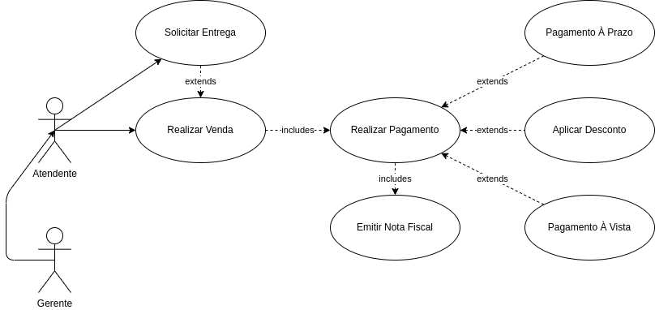

# Engenharia de Software - Caso de Uso

## Exercício

### A partir deste cenário identifique:
- Stakeholders
- Requisitos Funcionais(RF) e Requisitos Não Funcionais RNF)
- Modele o Diagrama de Caso de Uso
- Escolha um caso de uso para descrever a narrativa, contendo: descrição, pré-condição, pós condição, fluxo principal, fluxo de exceção

Uma loja pretende desenvolver um sistema. Essa empresa tem dois tipos de colaboradores, o atendente e o gerente. A principal atividade a ser automatizada pelo sistema é o processamento de vendas, cuja execução é altamente complexa. Dessa forma, a modelagem deve ser realizada de maneira estruturada e organizada, tendo como foco a sua reutilização em diferentes contextos. As vendas são realizadas quase integralmente por atendentes, entretanto, caso haja grande quantidade de clientes, os gerentes também podem processar vendas, por exemplo. O processamento de vendas pode ser realizado considerando duas modalidades de pagamento: a prazo ou à vista, todavia, independentemente da forma de pagamento, há um conjunto comum de ações que sempre são realizadas. As compras a prazo englobam dois modos de pagamento (via cartão de crédito e via boleto) que possuem ações comuns, mas que se diferem nas ações finais. Para algumas formas de processamento de vendas é aplicado um desconto sobre o valor total. O desconto deve ser aplicado sempre que o pagamento for realizado à vista ou quando o pagamento for realizado via boleto com parcelamento em até seis vezes. Entretanto, a loja oferece como forma de pagamento boleto com parcelamento em até doze vezes. No processamento de vendas, após a confirmação do pagamento, é necessário emitir a nota fiscal dos produtos. Apenas em circunstâncias em que algum dos produtos vendidos não possa ser retirado na loja, deve ser possível solicitar a entrega pelo sistema.

### Diagrama de Caso de Uso:


**StakeHolders**
> Atendente, Gerente e Cliente

**Requisitos Funcionais (RF)**
```
Processar Vendas 
Realizar Pagamento
Emitir Nota Fiscal 
Solicitar Entrega
```

**Requisitos Não Funcionais (RNF)**
```
Precisa ser intuitivo para que não seja necessário treinamento
O sistema deve ser escalável, para não ter gargalo em picos de vendas
O tempo de resposta deve ser curto
```

### Narrativas:
1. Caso de Uso: Aplicar desconto
2. Atores: Atendente e Gerente 
3. Descrição: O sistema deverá aplicar o desconto de forma automática caso o cliente escolha o método de pagamento a vista ou boleto parcelado em até 6 vezes
4. Pré-Condição: Cliente ter escolhido o método de pagamento "à vista" ou "boleto em até 6 vezes"
5. Pós-Condição: O produto deverá ter seu preço reduzido com base no desconto aplicado
6. Fluxo Principal:

7. Fluxo de Exceção: O sistema verifica as regras de desconto, para aplicar ou não, caso não sejam atendidos os requisitos, não será aplicado desconto 